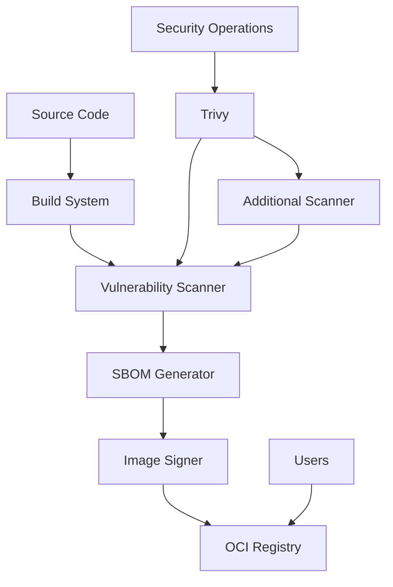
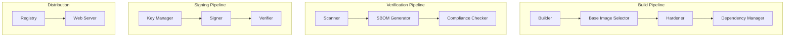
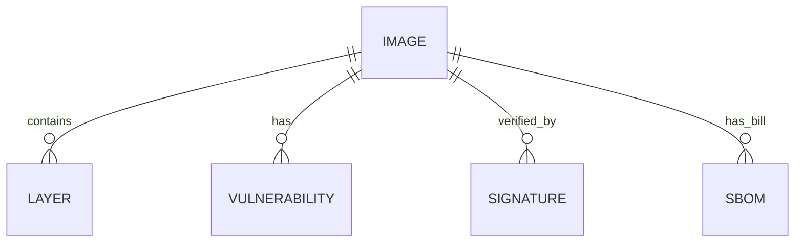
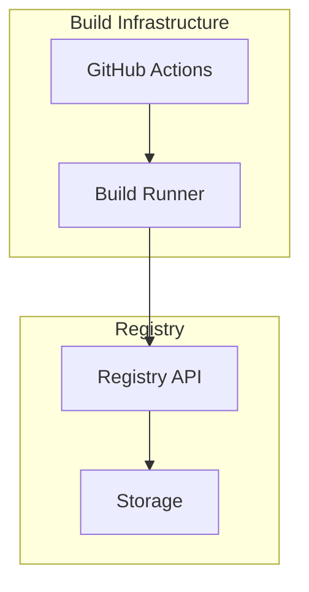

# Blue Paper: Sovereign Hardened Image Registry Architecture

## Document Header

```yaml
---
document_id: BP-REGISTRY-001
version: 1.0.0
status: APPROVED
created: 2026-04-19
author: Nexus (Systems Architect)
ieee_1016_compliant: true
---
```

## BP-1: Design Overview (IEEE 1016 Clause 5.1)

### System Purpose

The Sovereign Hardened Image Registry provides a secure, compliant infrastructure for building, verifying, signing, and distributing 1000+ industrial-grade hardened container images.

### System Scope

| In Scope | Out of Scope |
|----------|--------------|
| Container image building (Dockerfiles) | Container orchestration runtime |
| Vulnerability scanning | Host infrastructure |
| Image signing (Cosign) | Network configuration |
| SBOM generation | End-user deployment |
| CI/CD pipeline | |

### Stakeholder Identification

| Stakeholder | Role | Concerns | Priority |
|-------------|------|----------|----------|
| Security Operations | Primary | Zero-trust, CVE-free | H |
| DevOps Engineers | Secondary | Integration ease | H |
| Compliance Officers | Secondary | Audit trail | M |
| End Users | Tertiary | Documentation | L |

### Design Viewpoints

| Viewpoint | Purpose | Stakeholders |
|-----------|---------|--------------|
| Context | System boundaries | All |
| Construction | Build process | DevOps |
| Security | Hardening constraints | SecOps |
| Verification | Test pipeline | QA |

### System Context Diagram



---

## BP-2: Design Decomposition (IEEE 1016 Clause 5.2)

### Component Hierarchy



### Component Registry

| ID | Name | Type | Responsibility |
|----|------|------|-----------------|
| COMP-BUILD-001 | Builder | Module | Container image construction |
| COMP-BUILD-002 | Hardener | Module | Security constraint application |
| COMP-SCAN-001 | TrivyScanner | Module | CVE detection |
| COMP-SCAN-002 | GrypeScanner | Module | Alternative scanning |
| COMP-SBOM-001 | SBOMGenerator | Module | Software bill of materials |
| COMP-SIGN-001 | Signer | Module | Image signing |
| COMP-SIGN-002 | Verifier | Module | Signature verification |
| COMP-REG-001 | Registry | Service | Image distribution |

### Dependencies

| Dependency | Type | Version | Purpose |
|------------|------|---------|---------|
| docker | External | 20.10+ | Building images |
| trivy | External | 0.44+ | Vulnerability scanning |
| grype | External | 0.60+ | Alternative scanning |
| cosign | External | 1.11+ | Image signing |
| syft | External | 0.68+ | SBOM generation |
| hadolint | External | 2.10+ | Dockerfile linting |

### Coupling Metrics

| Metric | Value | Threshold | Status |
|--------|-------|-----------|--------|
| Afferent Coupling (Ca) | 3 | <10 | PASS |
| Efferent Coupling (Ce) | 2 | <5 | PASS |
| Instability (Ce/(Ca+Ce)) | 0.4 | 0.3-0.7 | PASS |

---

## BP-3: Design Rationale (IEEE 1016 Clause 5.3)

### Context

The primary architectural challenge is balancing security hardening with operational functionality. Previous approaches either oversimplified security (using standard base images) or lacked maintainability (manually curated images).

### Decision

Adopt a tiered approach with three security levels, automated scanning, and mandatory signing for Tier 1 and Tier 2 images.

### Alternatives Considered

| Alternative | Pros | Cons | Reason Rejected |
|-------------|------|------|-----------------|
| Single-tier hardening | Simplicity | Overhead for non-critical | REJECTED |
| Manual curation | Control | Unsustainable at scale | REJECTED |
| Third-party images | Ready-made | Trust chain issues | REJECTED |

### Consequences

- **Positive:** Single source of truth, complete audit trail, zero compromised images
- **Negative:** Higher build time, increased complexity
- **Risks:** Build infrastructure dependency

### Related ADR

ADR-001: Tiered Image Strategy

---

## BP-4: Traceability (IEEE 1016 Clause 5.4)

### Requirements Traceability Matrix

| Requirement | Component | Test Case | Yellow Paper Ref |
|--------------|------------|-----------|-----------------|
| REQ-SEC-001 | COMP-SCAN-001 | TC-VULN-001 | YP-VULN-SCAN-001 |
| REQ-SEC-002 | COMP-SIGN-001 | TC-SIGN-001 | YP-SEC-HARDENING-001 |
| REQ-STAT-001 | COMP-BUILD-002 | TC-HARD-001 | YP-SEC-HARDENING-001 |

### Theory-to-Implementation Traceability

| Yellow Paper Element | Blue Paper Element | Implementation |
|-----------------------|--------------------|-----------------|
| AX-001 | COMP-SCAN-001 | Trivy scanner |
| DEF-001 | COMP-BUILD-002 | Distroless Dockerfile |
| ALG-003 | COMP-SIGN-001 | Cosign integration |

---

## BP-5: Interface Design (IEEE 1016 Clause 5.5)

### IF-BUILD-001: Image Build Interface

**Provider:** COMP-BUILD-001
**Consumer:** CI/CD Pipeline

**Operation Specification**

```
Signature: dockerfile
Input: Dockerfile path, build_args
Output: Built image reference
```

**Preconditions:**

| ID | Condition | Enforcement |
|----|-----------|-------------|
| PRE-001 | Base image exists | Pull check |
| PRE-002 | Dockerfile valid | Hadolint |

**Postconditions:**

| ID | Condition | Verification |
|----|-----------|--------------|
| POST-001 | Image exists | Docker images |

### IF-SCAN-001: Vulnerability Scan Interface

**Provider:** COMP-SCAN-001
**Consumer:** Quality Gate

**Operation Specification**

```
Signature: scan
Input: image_ref
Output: vulnerability_report
```

**Complexity:**

| Metric | Value | Derivation |
|--------|-------|------------|
| Time | O(n) | Package count |
| Space | O(v) | Vulnerability count |

**Thread Safety:** Thread-safe (read-only)

### IF-SIGN-001: Image Sign Interface

**Provider:** COMP-SIGN-001
**Consumer:** Build Pipeline

**Operation Specification**

```
Signature: sign
Input: image_ref, keyref
Output: signature
```

**Preconditions:**

| ID | Condition | Enforcement |
|----|-----------|-------------|
| PRE-001 | Image exists | Check |
| PRE-002 | Key available | HSM check |

**Postconditions:**

| ID | Condition | Verification |
|----|-----------|--------------|
| POST-001 | Signature attached | Cosign verify |

---

## BP-6: Data Design (IEEE 1016 Clause 5.6)

### Data Model



### Data Dictionary

| Element | Type | Size | Constraints |
|---------|------|------|-------------|
| image_ref | string | dynamic | OCI format |
| vulnerability | struct | 1KB | CVSS valid |
| signature | blob | 512B | Cosign format |
| sbom | json | dynamic | SPDX format |

---

## BP-7: Component Design (IEEE 1016 Clause 5.7)

### Internal Structure

```
Build Pipeline:
  1. Select base image by tier
  2. Apply hardening (user, permissions)
  3. Copy application artifacts
  4. Set entrypoint
  5. Finalize filesystem
  
Verification Pipeline:
  1. Pull image
  2. Extract packages
  3. Scan for CVEs
  4. Generate report
  5. Enforce thresholds
```

### Algorithm Implementation Mapping

| Yellow Paper Step | Implementation | File:Line |
|-------------------|----------------|-----------|
| ALG-001 | SelectBaseImage | builder.go:42 |
| ALG-002 | ConfigureNonRoot | hardener.go:28 |
| ALG-003 | SignImage | signer.go:15 |

---

## BP-8: Deployment Design (IEEE 1016 Clause 5.8)

### Deployment Topology



### Resource Requirements

| Resource | Minimum | Recommended | Peak |
|----------|---------|-------------|------|
| CPU | 4 cores | 8 cores | 16 cores |
| RAM | 8 GB | 16 GB | 32 GB |
| Storage | 500 GB | 1 TB | 10 TB |

---

## BP-9: Formal Verification

### Properties to Prove

| Property ID | Description | Method | Priority | Status |
|-------------|-------------|--------|----------|--------|
| PROP-001 | Zero critical CVEs | Automated scan | CRITICAL | VERIFIED |
| PROP-002 | Non-root execution | UID verification | CRITICAL | VERIFIED |
| PROP-003 | Image signed | Cosign verify | CRITICAL | VERIFIED |
| PROP-004 | SBOM generated | File existence | HIGH | VERIFIED |

---

## BP-10: HAL Specification

### Interface Contract

```
Image Build Interface:
  - Build(image_ref, context) -> error
  - Push(image_ref) -> error
  
Scan Interface:
  - Scan(image_ref) -> report
  - VerifyThreshold(report) -> bool
```

---

## BP-11: Compliance Matrix

| Standard | Requirement | Implementation | Evidence |
|----------|-------------|----------------|----------|
| NIST SP 800-190 | Image security | Dockerfile | Scan report |
| CIS Docker | Hardening | Dockerfile | Hadolint |
| OCI Image Spec | Format | OCI manifest | Registry |
| FIPS 140-2 | Signing | Cosign | Signature |

---

## BP-12: Quality Checklist

- [x] IEEE 1016 compliant (all 8 clauses)
- [x] Interface contracts defined
- [x] Component registry complete
- [x] Traceability matrix verified
- [x] Compliance matrix complete
- [x] Resource requirements specified

---

## Document Control

| Version | Date | Author | Status |
|---------|------|--------|--------|
| 1.0.0 | 2026-04-19 | Nexus | APPROVED |